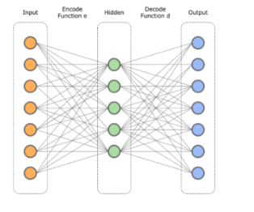

# Big Data Application in recommender systems :smiley:  fa18-523-70

| Sushmita Dash
| sushdash@iu.edu
| Indiana University
| hid: fa18-523-70
| github: [:cloud:](https://github.com/cloudmesh-community/fa18-523-70/blob/master/paper/paper.md)

---

Keywords: recommender system, TV genome, KNN classification

---


## Introduction

In today’s world where people have a very busy lifestyle. They often do not have the time and patience to go through a very vast selection of options available to them. This is applicable in many aspects such as watching TV shows or getting a product online. Here is when our recommendation system comes into play. It plays a critical role in engaging the customers in the online service platforms.
Earlier, in order to find a movie or a product that the user likes, they had to tediously browse through media catalogs or product catalogs. Amidst information overload, shorter attention span, and competing content, the only way to grab users’ attention is personalization. This is where big data comes into play

There are many daily life examples where we can see the use of the recommender systems. Few examples are as follows:

1. Netflix uses this to show a personalized recommendation of the shows you may like based on the TV programs you have seen before
2. Various other tech giants also use this technology. For example, we often see friend suggestions in Facebook. It will be based on various criteria like how many mutual friends do we have. If we have been in any photo together or in the same school etc
3. We can see similar experience when we are browsing through a product catalog in Amazon or any other online shopping website. It will show us similar products based on our taste.

## What is a recommender system?

A recommendation engine filters the data using different algorithms and recommends the most relevant items to users. It first captures the past behavior of a customer and based on that, recommends products which the users might be likely to buy or watch [@fa18-523-70-TowardsDataScience].
Below is a very simple illustration of how recommender systems work in the context of an e-commerce site.

![Simple Recommender System[@fa18-523-70-TowardsDataScience]](images/Picture1.jpg){#fig:SimpleRecommenderSystemAnalogy}


Two users buy the same items A and B from an ecommerce store. When this happens the similarity index of these two users is computed. Depending on the score the system can recommend item C to the other user because it detects that those two users are similar in terms of the items they purchase[@fa18-523-70-datacamp].


## How does the recommender system work?

A typical recommendation engine processes data through the following four phases namely collection, storing, analyzing and filtering[@fa18-523-70-analyticsvidhya].

The phases are described below:

![Phases of recommendation engine [@fa18-523-70-TowardsDataScience]](images/Picture2.jpg){#fig:PhasesOfRecommendationEngine}

### Collection of Data

The first step in creating a recommendation engine is gathering data. Data can be either explicit or implicit data. Explicit data would consist of data inputted by users such as ratings and comments on products. And implicit data would be the order history/return history, Cart events, Pageviews, Click thru and search log. This data set will be created for every user visiting the site.

Behavior data is easy to collect because you can keep a log of user activities on your site. Collecting this data is also straightforward because it doesn’t need any extra action from the user; they’re already using the application. The downside of this approach is that it’s harder to analyze the data. For example, filtering the needful logs from the less needful ones can be difficult.

Since each user is bound to have different likes or dislikes about a product, their data sets will be distinct. Over time as you ‘feed’ the engine more data, it gets smarter and smarter with its recommendations so that your email subscribers and customers are more likely to engage, click and buy. Just like how the Amazon’s recommendation engine works with the ‘Frequently bought together’ and ‘Recommended for you’ tab.

### Storing the data

The more training data is available for the algorithms, better the recommendations will be. This means that any recommendations project can quickly turn into a big data project. The storage of the data depends on whether we are trying to capture user’s input or behavior and on factors such as ease of implementation, size of the data, integration with other systems and portability. We can use noSQL database or a standard SQL database, etc. for data storage. When saving user ratings or comments, a scalable and managed database minimizes the number of tasks required and helps to focus on the recommendation. Cloud SQL fulfills both of these needs and also makes it easy to load the data directly from Spark.

### Analyzing the data

In order to find items with similar user engagement data, data is filtered using different analysis methods. 
Some of the ways in which we can analyze the data are:

* Real-time systems can process data as it’s created. This type of system usually involves tools that can process and analyze streams of events. A real-time system would be required to give in-the-moment recommendations.

* Batch analysis demands you to process the data periodically. This approach implies that enough data needs to be created in order to make the analysis relevant, such as daily sales volume. A batch system might work fine to send an e-mail at a later date.

* Near-real-time analysis lets you gather data quickly so you can refresh the analytics every few minutes or seconds. A near-real-time system works best for providing recommendations during the same browsing session.

:o: citation missing

**Algorithm:**

:o: just use verbatim, dont make it complex

```
</br> for each item in product catalog, I<sub>1</sub><br/>
for each customer C who purchased I<sub>1</sub><br/>
 for each item I<sub>2</sub> purchased by customer C<br/>
			Record that a customer purchased I<sub>1</sub> and I<sub>2</sub><br/>
for each item I<sub>2</sub><br/>
 compute the similarity between I<sub>1</sub> and I<sub>2</sub><br/>
```

**Algorithm Complexity:**

- Worst Case: O(N<sub>2 * M) :o: check
- In practice: O(N * M), cause customers have fewer purchases

 
### Filtering the data

After collecting and storing the data, we have to filter it so as to extract the relevant information required to make the final recommendations. We need to filter the data to get the relevant data necessary to provide recommendations to the user. We have to choose an algorithm that would better suit the recommendation engine. For example

* **Content-based**: A popular, recommended product has similar characteristics to what a user views or likes.

* **Cluster**: Recommended products go well together, no matter what other users have done.

* **Collaborative**: Other users, who like the same products as another user views or likes, will also like a recommended product.  Collaborative filtering enables you to make product attributes theoretical and make predictions based on user tastes. The output of this filtering is based on the assumption that two users who liked the same products in the past will probably like the same ones now or in the future.

Data about ratings or interactions can be represented as a set of matrices, with products and users as dimensions. Assume that the following two matrices are similar, but then we deduct the second from the first by replacing existing ratings with the number one and missing ratings by the number zero. The resulting matrix is a truth table where a number one represents an interaction by users with a product.

![Rating Matrix [@fa18-523-70-TowardsDataScience]](images/Picture4.jpg){#fig:RatingMatrix}


We use K-Nearest algorithm, Jaccard’s coefficient, Dijkstra’s algorithm, cosine similarity to better relate the data sets of people for recommending based on the rating or product.

![K Nearest algorithm [@fa18-523-70-TowardsDataScience]](images/Picture5.jpg){#fig:KNearestAlgorithm}


The above graph shows how a k-nearest algorithm’s cluster filtering works.
Then finally, the result obtained after filtering and using the algorithm, recommendations are given to the user based on the timeliness of the type of recommendation. Whether real time recommendation or sending an email later after some time.

![Big Data Architecture Of Recommendation System [@fa18-523-70-datacamp]](images/Picture6.jpg){#fig:BigDataArchitectureOfRecommendationSystem}


## Types of recommender systems

Recommender systems are among the most popular applications of data science today[@fa18-523-70-GoogeCloud]. They are used to predict the "rating" or "preference" that a user would give to an item. Almost every major tech company has applied them in some form or the other: Amazon uses it to suggest products to customers, YouTube uses it to decide which video to play next on auto play, and Facebook uses it to recommend pages to like and people to follow. What's more, for some companies -think Netflix and Spotify-, the business model and its success revolves around the potency of their recommendations. In fact, Netflix even offered a million dollars in 2009 to anyone who could improve its system by 10%.

1.	**Simple recommenders**: offer generalized recommendations to every user, based on movie popularity and/or genre. The basic idea behind this system is that movies that are more popular and critically acclaimed will have a higher probability of being liked by the average audience. IMDB Top 250 is an example of this system.

2.	**Content-based recommenders**: suggest similar items based on a particular item. This system uses item metadata, such as genre, director, description, actors, etc. for movies, to make these recommendations. The general idea behind these recommender systems is that if a person liked a particular item, he or she will also like an item that is similar to it.

3.	**Collaborative filtering engines**: these systems try to predict the rating or preference that a user would give an item-based on past ratings and preferences of other users. Collaborative filters do not require item metadata like its content-based counterparts. Enables users to explore diverse contents, dissimilar to that viewed in the past.

## Algorithms
Content based methods are based on similarity of item attributes and collaborative methods calculate similarity from interactions[@fa18-523-70-medium]. Here we discuss few collaborative methods:

### K-Nearest Neighbors

- Computes similarity of users
- Find k most similar users to user 'a'
- Recommends movies not seen by user 'a'

The simplest algorithm computes cosine or correlation similarity of rows (users) or columns (items) and recommends items that k — nearest neighbors enjoyed.

### Association Rules

Association rules can also be used for recommendation. Items that are frequently consumed together are connected with an edge in the graph. You can see clusters of best sellers (densely connected items that almost everybody interacted with) and small separated clusters of niche content[@fa18-523-70-medium].


### Matrix Factorization

> "Matrix factorization models map both users and items to a joint latent factor space of dimensionality f, such that user-item interactions are modeled as inner products in that space. Accordingly, each item i is associated with a vector qi ∈ Rf
, and each user u is associated with a vector pu ∈ Rf. For a given item i, the elements of qi  measure the extent to which the item possesses those factors, positive or negative. For a given user u, the elements of pu  measure the extent of interest the user has in items that are high on the corresponding factors, again, positive or negative. The resulting dot product,
qi T  pu, captures the interaction between user u and item i—the user’s overall interest in the item’s characteristics. This approximates user u’s rating of item i, which is denoted by rui, leading to the estimate [@fa18-523-70-datajobs]."

Most popular training algorithm is a stochastic gradient descent (SGD) minimizing loss by gradient updates of both columns and rows of p a q matrices. SGD updates each parameter independently. Derive the loss function wrt each parameter.


### Deep Neural Networks

Rating matrix can be also compressed by a neural network. So called autoencoder is very similar to the matrix factorization. Deep autoencoders, with multiple hidden layers and nonlinearities are more powerful but harder to train. Neural net can be also used to preprocess item attributes so we can combine content based and collaborative approaches.

{#fig: NeuralNetworks}
[@fa18-523-70-medium]


## Evaluation of recommender systems

Few methods how the accuracy of a recommender system can be evaluated are as follows:


### Validation of Recommender System

- Recommenders can be evaluated similarly as classical machine learning models on historical data
- Users are divided into:
  * Training set - This is fully submitted to the recommender system
  * Testing set - This is submitted partially and used to evaluate the recommender

### Root mean squared error

- When some obeserved data is provided,the recommender system is to predict the rating of an unknown user-item pair

> "The root-mean-square deviation (RMSD) or root-mean-square error (RMSE) (or sometimes root-mean-squared error) is a frequently used measure of the differences between values (sample or population values) predicted by a model or an estimator and the values observed. The RMSD represents the square root of the second sample moment of the differences between predicted values and observed values or the quadratic mean of these differences[@fa18-523-70-wiki]."


### Top N Recommendations

> "The explosive growth of the world-wide-web and the emergence of e-commerce has led to the development of recommender systems---a personalized information filtering technology used to identify a set of N items that will be of interest to a certain user. User-based Collaborative filtering is the most successful technology for building recommender systems to date, and is extensively used in many commercial recommender systems. Unfortunately, the computational complexity of these methods grows linearly with the number of customers that in typical commercial applications can grow to be several millions. To address these scalability concerns item-based recommendation techniques have been developed that analyze the user-item matrix to identify relations between the different items, and use these relations to compute the list of recommendations.In this paper we present one such class of item-based recommendation algorithms that first determine the similarities between the various items and then used them to identify the set of items to be recommended. The key steps in this class of algorithms are (i) the method used to compute the similarity between the items, and (ii) the method used to combine these similarities in order to compute the similarity between a basket of items and a candidate recommender item. Our experimental evaluation on five different datasets show that the proposed item-based algorithms are up to 28 times faster than the traditional user-neighborhood based recommender systems and provide recommendations whose quality is up to 27% better[@fa18-523-70-semanticsscholar]."


## Acknowledgement

I am thankful to Dr Gregor Von Laszewski to help me complete the project and the paper for the Big Data Applications and Analytics course
